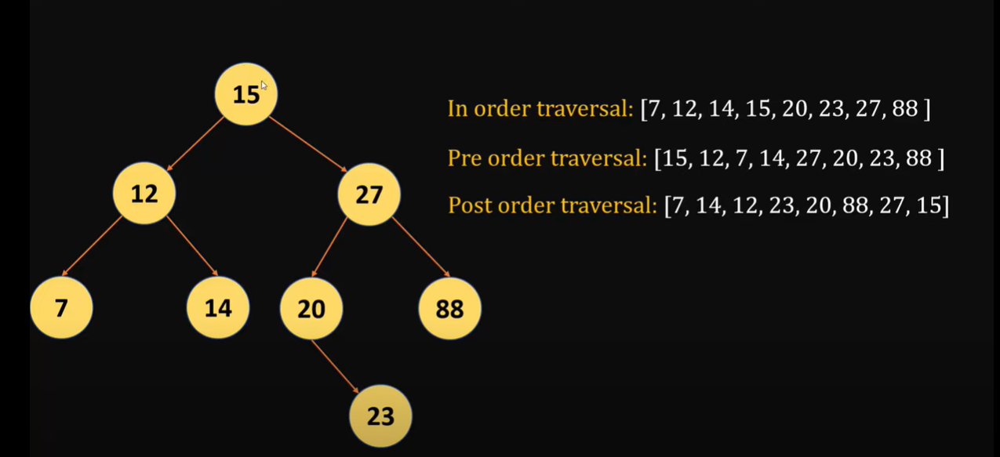

# tree

## 1. first_tree is a Gernral tree

<h1 style="color: yellow; opacity: 0.80;"> Tree Genral  </strong>

--> BTS is the maximam number of node is 2 to be Binary tree 
Search complexity is O(logn)
n=8 8->4->2->1
3 itreations  log2=3

- <a href="https://www.youtube.com/watch?v=lFq5mYUWEBk">Binary search tree -- link</a>

<h1 style="color: Pink; opacity: 0.80;"> Linear Search  </strong>
--> In linear Search if the n=8 then 

mean 8 itreations <h1 style="color: orange; opacity: 0.80;"> Breadth First Search  </strong>

<h1 style="color: green; opacity: 0.90;"> Depth First Search  </strong>

1. In order traversal
2. Pre order traversal  -- dfs 
3. post order traversal

- <a href="https://www.youtube.com/watch?v=JnrbMQyGLiU">Delete Node in tree vidue-- link</a>
- <a href="https://github.com/codebasics/data-structures-algorithms-python/blob/master/data_structures/8_Binary_Tree_1/8_binary_tree_part_1_exercise.md">tree min , max , post ,pre order in Binary tree search  task--link</a>
- <a href="https://github.com/codebasics/data-structures-algorithms-python/blob/master/data_structures/9_Binary_Tree_2/9_binary_tree_part_2_exercise.md">Delete task--link</a>

1. Level-order Traversal (BFS)