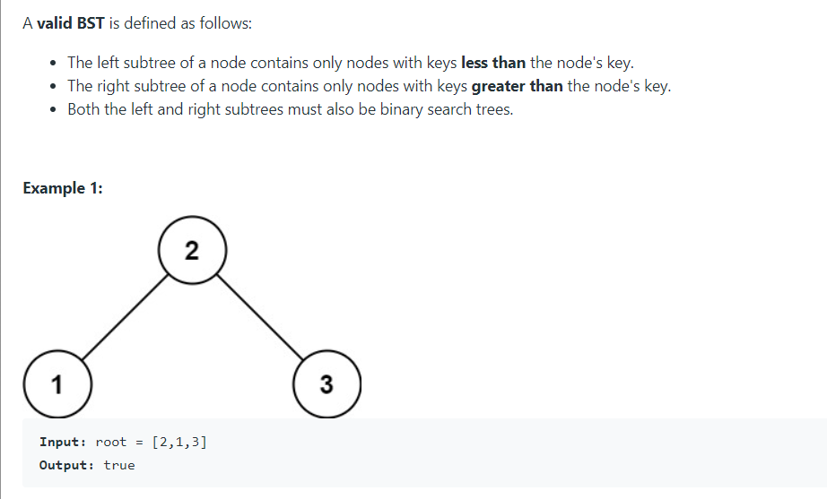

# Given the root of a binary tree, determine if it is a valid binary search tree (BST).

# Time complexity : O(N) since we visit each node exactly once.
# Space complexity : O(N) since we keep up to the entire tree.
