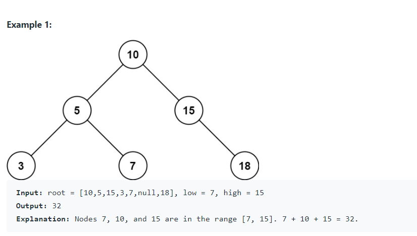

# Given the root node of a binary search tree and two integers low and high, return the sum of values of all nodes with a value in the inclusive range [low, high].

## Complexity Analysis

## Time Complexity: O(N), where N is the number of nodes in the tree.

## Space Complexity: O(N)

## For the recursive implementation, the recursion will consume additional space in the function call